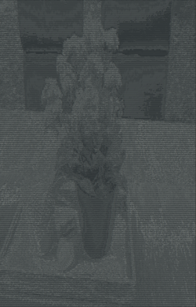

# ASCII-Art
#### With this program you can print a ascii representation of an image in your terminal
## Usage
##### `python asciiart.py imagePath -<light/dark>`
The 2. argument specifies your terminal background color. This is needed for printing the image correctly.
 When the image isn't visible, change your terminal font size to a lower size or lower the image's size.
## Examples
### Before : 
   
### After  :  
   
      Note: I resized the image and used the -dark argument
## Dependencies
`pip install -r requirements.txt`
